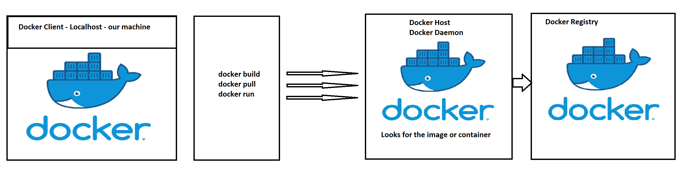
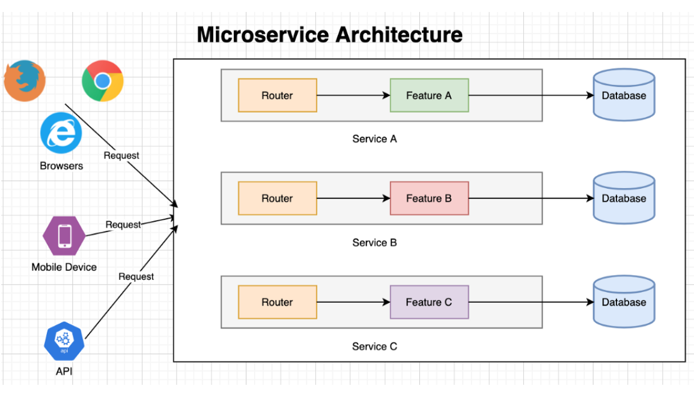
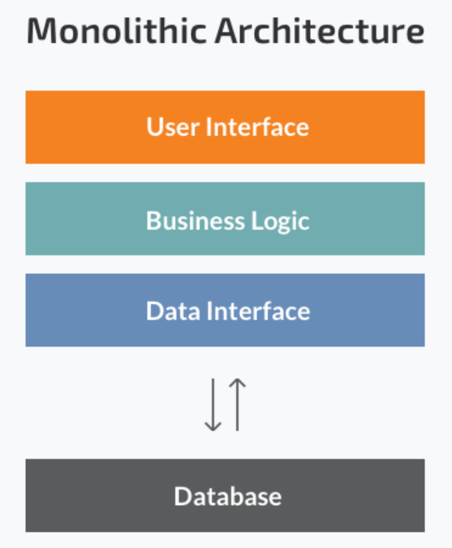

# Containerisation with Docker

## What is Docker
- Docker is an open source platform **Docker hub documentation**
- It helps and enables us to separate applications from the infrastructure
- It allows us to deliver software faster and is lightweight 
- Docker is written in GO language
  
### Why Docker
- Multi billion dollar companies are using or adopting Docker i.e Ebay, Netflix, Sky
- Docker adoption is anticipated to be 50% by the end of 2020
- 

### Difference between VM and Docker
- Docker is light weight and user friendly
- Docker shares the resource of OS as opposed to using the OS completely
- Docker engine connects the container with OS and only uses the resources required


### Docker API


### Docker Commands
- ``` docker pull <name_of_image> ```
- ``` docker run <name_of_image> ``` runs the image in a container (-d to run detached)
- ``` docker build -t <name_of_image> ```
- ``` docker commit <name_of_image/container-id> ```
- ``` docker start <container-id> ``` - starts the container with specified id
- ``` docker stop <container-id/name> ``` - stops the container with specified id
- ``` docker rm <container-id/name> ```- removes the container with specified id (data is removed)
- ``` docker ps ``` to check currently running containers
- ``` docker ps -a ``` to check existing containers
- ``` docker images ``` to check existing images
- ``` docker history <image_id> ``` to check 
- ``` docker inspect <image_id> ``` to check the contents of the image
- ``` docker logs <container_id> ``` shows the logs of the containter (can direct to a text file with > logs.txt)

### logging into a running container
- ``` docker exec -it <name_of_container/id>``` "it" means interactive shell

### Making docker docs available on our localhost
``` docker run -d -p 4000:4000 docs/docker/id ```
** - port mapping in our containers with localhost **
``` docker run -d -p <localhost-port>:<container-port>```
``` docker run -d -p 4001:4000 <image_name>```


### Copying a file to docker container
``` docker cp <file_name> "<container_id>:<desired_file_path>"```

### Commiting changes to Dockerhub
- ``` docker commit <image id> <username>/<repo_name>``` commits the changes to docker repo
- ``` docker push ``` pushes the changes to docker repo

### Building a docker image
- To build a docker image we need to create a Dockerfile (Naming convention Dockerfile)
- Used to automate tasks in an image / container
#### **Information Required :**
- Depends on client requirements
- Need to know dependencies to run app
- Need to wrap all the dependencies within Dockerfile and instruct the execution command

#### Syntax and Keywords to create Dockerfile
- ```FROM``` is used to tell docker which base image to use to build our image ```nginx as base image```
- ```LABEL MAINTAINER=bgilbert@spartaglobal.com```
- ```COPY``` files/folders from localhost to the container/image
- ```EXPOSE``` default port
- ```CMD``` the execution command ```["nginx", "-g", "daemon off"]```

## Microservices


### Micro-Services
-	Highly maintainable and testable
-	Independently Deployable
-	Loosely coupled
-	Organised around business capabilities
-	Owned by small teams

### Who uses microservices?
-	Netflix 
-	Amazon
-	PayPal

### Monolith Architecture 

-	Simple but has limitations and complexity
-	Heavy apps can slow down start up time
-	Each update results into redeploying the full stack
-	Challenging to scale up on demand
-	Fruitful for simple and lightweight apps

### Kubernetes (k8)
Orchestration tool for containers
Helps manage containers and their behaviour (if container breaks or goes wrong)
Kubernetes can then spin up another one automatically (similar to auto scaling)
-	App always running
-	Scale on demand
-	Auto Scale
-	Use individual IPs
-	Create ingress controller
-	Can deploy using Kubernetes
