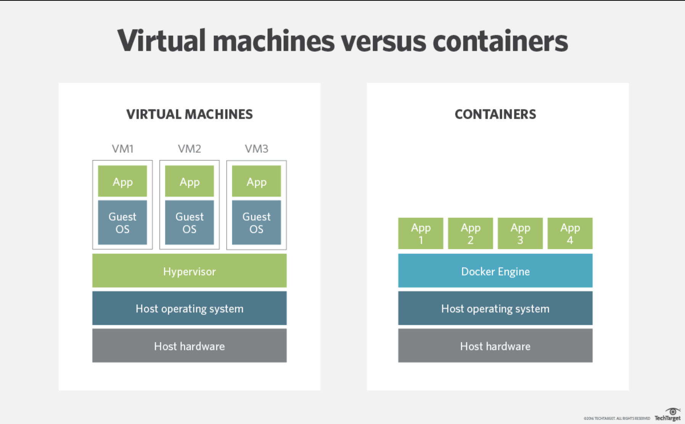

# Containerisation with Docker

## What is Docker
- Docker is an open source platform **Docker hub documentation**
- It helps and enables us to separate applications from the infrastructure
- It allows us to deliver software faster and is lightweight 
- Docker is written in GO language
  
### Why Docker
- Multi billion dollar companies are using or adopting Docker i.e Ebay, Netflix, Sky
- Docker adoption is anticipated to be 50% by the end of 2020
- 

### Difference between VM and Docker
- Docker is light weight and user friendly
- Docker shares the resource of OS as opposed to using the OS completely
- Docker engine connects the container with OS and only uses the resources required


### Demand and future of Docker

### Docker API


### Docker Commands
- ``` docker pull <name_of_image> ```
- ``` docker run <name_of_image> ``` runs the image in a container (-d to run detached)
- ``` docker build -t <name_of_image> ```
- ``` docker commit <name_of_image/container-id> ```
- ``` docker start <container-id> ``` - starts the container with specified id
- ``` docker stop <container-id/name> ``` - stops the container with specified id
- ``` docker rm <container-id/name> ```- removes the container with specified id (data is removed)
- ``` docker ps ``` to check currently running containers
- ``` docker ps -a ``` to check existing containers
- ``` docker images ``` to check existing images
### logging into a running container
- ``` docker exec -it <name_of_container/id>``` 

### Making docker docs available on our localhost
``` docker run -d -p 4000:4000 docs/docker/id ```
** - port mapping in our containers with localhost **
``` docker run -d -p <localhost-port>:<container-port>```
``` docker run -d -p 4001:4000 <image_name>


### Copying a file to docker container
- ``` docker cp <file_name> "<container_id>:<desired_file_path>"
